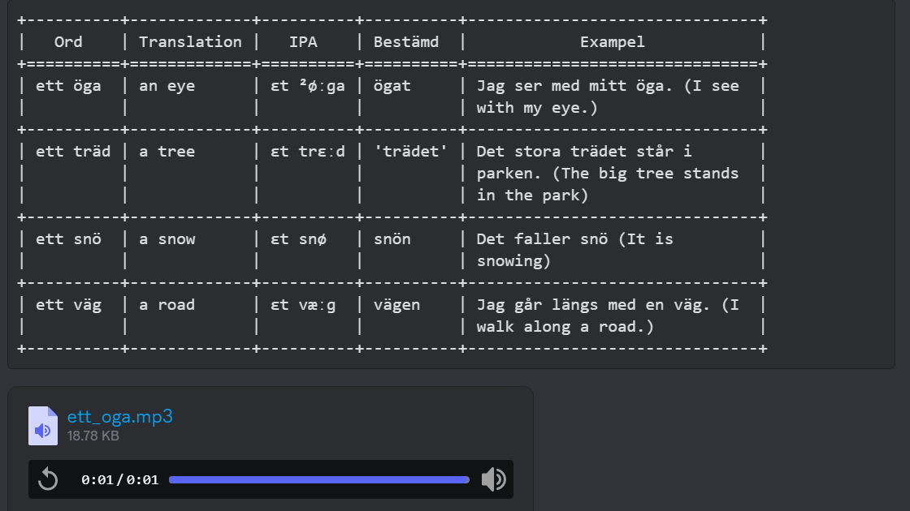

# Discord Bot Application

## Description
This Discord bot application is designed to read user messages in a channel, parse Markdown tables, transform them into ASCII art tables. Additionally, it creates a thread from the triggering message and replies directly to that thread with the formatted table and MP3 attachments.

It use CHATGPT to:
- Fix any spelling error in Swedish
- Translate the word to Swedish
- Create IPA pronunication of the word
- Create **bestämp** form of the word
- Create a short example usage of the word in a sentence

It use Elevenlabs API to:
- Create a pronuncation of the word in Swedish
- Save the audio before sending to Discord
## Features
- Parses Markdown tables from user messages
- Transforms tables into ASCII art format
- Attaches MP3 files to each row in the table
- Creates a thread from the triggering message
- Replies directly to the created thread with the formatted table and MP3 attachments

## Installation
1. Clone this repository:
    ```sh
        git clone https://github.com/duong-nguyen-fi/table-discord-bot.git
    ```
2. Install the required dependencies:
    ```sh
       pip install -r requirements.txt
    ```
3. Set the following environment variables
    ```sh
       export ELEVENLABS_API=''
       export DISCORD_TOKEN=''
       export CHAT_GPT_API=''
    ```    
4. Run the application
    ```sh
    python3 table.py
    ```

## Usage
1. Invite the bot to your Discord server.
2. Start a message to a text channel that begins with '/table'
3. In each of the next lines in the message with a word (a NOUN) in Swedish. Preferly with in prefix **en** or **ett**
4. The bot will create a thread and reply with a formatted ASCII table and attach mp3 files of the pronunciation of the words

## Example
1. Message
    ```
        /table 
        oga
        träd
        snö
        väg
    ```
2. Reply

